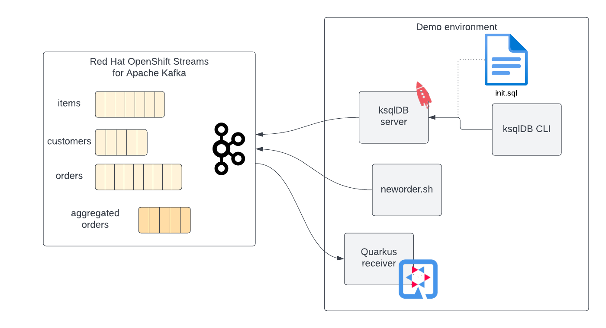
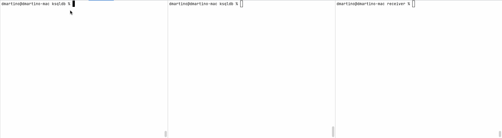

# Using ksqlDB on RHOASK
Source code for RH Blog "Using ksqlDB with Red Hat® OpenShift® Streams for Apache Kafka"

Demo scenario:

Integrating the ksqlDB CLI:

Validate push queries with ksqlDB CLI and a Quarkus application: 
